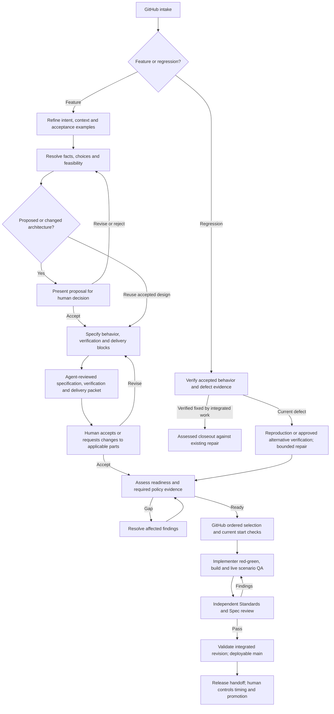

# Sidkik orchestration process

Current operating-process draft, reconciled 2026-09-10 with the user’s recorded decisions. The [canonical map](https://github.com/sidkik/core/issues/507) indexes their owning receipts. This revision incorporates settled direction but does not adopt the whole process, select production architecture or establish runtime enforcement. The [historical snapshot — source locator](https://github.com/sidkik/planning/blob/a52da1c2aa2c99bbca5cb8ecd4496e9b37302ba4/docs/work/agent-orchestration/items/core-gh-517-document-organization/source-navigation.research.md#source-08ca39189ec6) and its exact source asset preserve the previously reviewed input; earlier trials and reviews do not automatically validate this revision.

The [work-artifacts skill](../../../../.claude/skills/work-artifacts/SKILL.md) owns document types, container hierarchy and metadata. The [governed-context proposal](../workstreams/context/governed-context.spec.md) owns proposed retrieval and assessment behavior. This file owns the initiative's refinement, skill routing and readiness process.

Applicability: this shared procedure applies to the work identified by the current user and its owning repository. The September 6 reference journeys are Core-only: frontend mocks and Mux alignment belong to separate Web Platform work; Core acceptance uses its public contracts and scenario runner. Those example boundaries do not make Core the delivery repository for every new initiative. Resolve the actual scope and relevant repository standards before work; consumer impact still needs a disposition.

## Combine the sources deliberately

Anthropic describes an artifact-driven loop: capture intent, apply organizational skills during specification, provide continuous implementation feedback, and independently verify completed work. Its example human gates and runtime choices are not automatically Sidkik policy. [AI-native SDLC playbook](https://claude.com/blog/the-ai-native-sdlc-playbook)

The installed [ask-matt router](../../../../.agents/skills/ask-matt/SKILL.md) defines the composition: repo-backed refinement uses grill-with-docs (grilling + domain-modeling); incoming work enters through triage; large multi-session uncertainty uses wayfinder. Research/prototype/diagnosis answer particular questions, to-spec/to-tickets synthesize settled work, and implement drives TDD followed by code-review. The [skill mapping below](#select-the-skill-flow-from-the-actual-situation) includes context/handoff, design and core-specific skills, with their triggers and outputs. This is a Sidkik adaptation; inspecting these workflows does not mean their publishing or implementation actions have run.

## The funnel and its loop

Required policy checkpoints apply before actual affected advancement, including during planning, using the [checkpoint boundaries](../workstreams/context/governed-context.spec.md#policy-agent-checkpoints-across-the-process). Ordinary conversation and bookkeeping are not separate transitions; an explicitly scoped assessment can cover a coherent sequence while preserving its individual conditions. The [context mapping](../workstreams/context/governed-context.spec.md#workflow-handoffs-producers-durable-records-and-recipients) names the producers, records and recipients. Feature preparation and regression preparation are distinct; neither diagram traversal nor publication establishes readiness.

These are evidence states, not required departments or separate agents. A small regression can traverse them in one session. A large feature needs a decision map and multiple independently integrable blocks. Draft acceptance examples early: they expose uncertainty before prose makes a proposal appear settled.

## Required stage completion

Following the applicable process is mandatory. Establish the route and its required criteria before performing the governed activity; keep them in the existing work record, not a new checklist document. Select the stages below from the prescribed skill route and actual scope. Continuations retain completed criteria only after checking their evidence and source applicability. A short repair does not acquire feature architecture or decomposition work merely because those stages exist.

| Stage | Required exit criteria (stable IDs) |
| --- | --- |
| Intake | **IN-1:** work owner, outcome, scope, current history/decisions and source revisions identified. **IN-2:** applicable route and required skills enumerated with trigger, source revision, load evidence and expected application result. Load each before its governed activity; `sdlc-process` first loads available `orchestrator` before route selection or evidence investigation under its [entry dependency](../../../../.claude/skills/sdlc-process/SKILL.md), then loads the applicable route skills. Actual current-context load evidence may be reused; a missing capability holds only orchestration-dependent actions. **IN-3:** current authority, ownership and smallest authorized next action established. |
| Verify | **VE-1:** reported behavior and accepted expectation separated from cause hypotheses; relevant current sources and integrated fixes inspected. **VE-2:** each material factual claim has evidence, revision/environment and limits; bug occurrence, current behavior and reproducibility have separate dispositions under the bug-intake contract. **VE-3:** dependent recommendations/questions use verified prerequisites; required skill application is supported by actual outputs, including checked helper returns when delegated. |
| Refine | **RF-1:** material unknowns resolved or explicitly dispositioned with affected scope. **RF-2:** prerequisite-ready human choices have actual scoped answers; proposed/changed architecture has the required revision-bound decision before dependent execution. Reuse unchanged accepted decisions. **RF-3:** observable acceptance examples and established vocabulary support the next block. |
| Brief / specify | **BR-1:** the owning brief/spec identifies scope, criterion IDs, expected behavior, verification seams and source decisions. **BR-2:** required context, skills, consumer impacts, delivery ownership and genuine dependencies are covered for this block; decomposition only when needed. |
| Review / disposition | **RV-1:** applicable independent review and policy checkpoint findings bind the actual candidate, criteria and history; required findings resolved for advancement, otherwise the stage remains visibly held. **RV-2:** proposed classification/next recipient or preparation packet and applicable human decisions are recorded; publication, acceptance and readiness remain distinct. |
| Ready / start | **RS-1:** each numbered readiness control below has evidence and a disposition. **RS-2:** native ordering, completed blockers, current authorization and actual allocated resources separately permit the proposed start; skipped higher work has a reason. **RS-3:** applicable checkpoint covers the exact action and its outstanding conditions. |
| Deliver | **DE-1:** accepted criteria map to actual implementation and required red–green or approved alternative verification, build and applicable live QA at identified revisions. **DE-2:** independent Standards and Spec findings resolved against the candidate. **DE-3:** integrated main has required validation and deployability dispositions; release authority remains separate. |
| Closeout | **CL-1:** owning GitHub work, related planning work and remaining findings have accurate dispositions. **CL-2:** applicable workspace cleanup and release or receiving-session handoff completed under the shared record procedure, with retained work/ownership accounted for. |

Incoming triage uses Intake → Verify → Refine (when choices remain) → Brief (when handing work onward) → Review/disposition → Closeout. Already-fixed intake uses its supported disposition without manufacturing a repair brief. Feature preparation uses applicable Intake/Verify/Refine/Brief/Review stages; authorized implementation then uses Ready/start → Deliver → Closeout. A research or spike return uses its learning contract through Verify and Review/disposition rather than claiming delivery. These stage names organize existing obligations; they create neither a new execution state machine nor a policy checkpoint per question or status update.

Triage closeout completes the intake disposition and any applicable handoff or cleanup; it does not claim delivery or require abandoning a workspace needed for the same authorized repair. When the user has authorized that repair and the applicable readiness/start assessment passes, continue into Ready/start → Deliver without an artificial session stop or repeated permission request. An investigation-only assignment ends at its scoped disposition. Delivery closeout retains DE-1–3 and the delivery record obligations.

For a current bug using reproduced repair, Verify also includes **VE-BUG1**, **VE-BUG2** and **VE-BUG3** from the [reproduction contract](#reproduction-complete-and-ready-for-repair). A triage disposition claiming “ready for repair” includes **RS-BUG1** in Review/disposition; an implementation route includes it in Ready/start. RS-BUG1 applies to a repair-ready or start claim, not ordinary triage classification or a requested stop/handoff. These criteria remain visible with a reasoned applicability result; non-bug work marks them N/A. Already-fixed dispositions and specifically approved alternative-verification routes use their own evidence contracts rather than manufacturing red; they cannot claim “reproduction complete.”

A criterion result records its ID, applicability and reason, status, supporting source/evidence revision, and assurance (`reported` or independently reviewed with its assessment reference). Include route-required skill load and application results separately. Enumeration comes from the pinned route and triggered skill requirements, not whichever successes the agent elects to report. Missing checklist/template or omitted required results are unknown; they cannot disappear from completion accounting. Additional triggered requirements extend the checklist before the affected activity.

A stage is complete only when every applicable required criterion has sufficient current evidence and its required independent assessment. A justified inapplicable criterion remains visible as N/A, distinct from a pass. An authorized exception identifies its actual human authority, affected criterion/revision, conditions and alternative proof; display it as an exception, not successful performance of the waived requirement. The stage cannot receive an unqualified complete result while relying on an exception. Loading a skill, writing “verification done,” or reporting an overall green check does not complete its outputs. Manual evidence and independent agent review supply their stated assurance, not authenticated compliance.

Missing future work is pending, not a violation. Claiming completion or attempting dependent advancement with an unmet required criterion is a process violation. Recover omitted authorized work immediately and reassess affected results. If a required step cannot be satisfied, tell the human the exact criterion, blocker, dependent work held and resolution needed; ask for the necessary decision or capability instead of silently skipping or waiving it. Continue independent authorized work. Existing exceptions require the applicable authority and checkpoint; agent confidence cannot grant one.

Status projection is bookkeeping: selecting a route, changing the displayed stage or correcting widget fields creates no policy checkpoint. Display a pending Ready/start stage while its execution conditions remain held, with incomplete criteria and the actual hold visible. A route label cannot authorize execution or imply its criteria passed; repair a stale projection from the underlying evidence without replaying unchanged assessments.

When corrected, withdraw the affected unsupported claim and dependent questions/recommendations, identify which completed criteria relied on it, and return those results to unresolved until the underlying flow is verified. Changed relevant facts or source revisions likewise invalidate dependent completion; preserve prior evidence as historical. Repeating a revised guess is not recovery.

### 1. Capture intent

Record the affected actor, current problem, desired observable outcome, reason to act, constraints and exclusions. Identify who can approve the intended behavior. Keep product intent separate from an initial technology suggestion.

Example: “An implementer can obtain a scoped decision while work remains active, and the decision remains available after coordinator restart.” Zulip is the intended human conversation surface; authenticated decision capture and coordinator continuation remain integration work, not a new chat-product selection.

Exit: an authorized person accepts the intended outcome and boundary, or the coordinator admits a qualifying regression within existing approved behavior. Bug reproduction alone does not establish the intended fix. Existing accepted intent should be reused rather than sent through approval again.

#### Bug intake: establish the defect, then preserve red–green

User requirements clarified 2026-09-06: verify that a reported bug is an actual defect, and use a focused failing reproduction/regression test wherever feasible. The submitter need not produce that test. Correlated GCP logs/traces can establish that the defect occurred; a repeatable test separately establishes that we can reproduce it. Record occurrence evidence and reproducibility as separate results rather than rejecting a credible report because the reporter cannot write a test.

Start from the symptom, expected behavior and whatever locating information is available: approximate time/timezone, environment, affected operation/request, tenant or entity. The intake/diagnosis agent gathers the missing technical evidence. Expected behavior must have an accepted basis; neither an ERROR log nor an arbitrary failing assertion establishes a product defect on its own.

Treat issue comments as evidence and clarifications of the reported behavior. An additional defect reported in a comment gets a separate linked intake or an explicit disposition requiring one, unless the authorized owner expressly expands this work's scope. Its unresolved questions do not block the original repair without a demonstrated dependency. Reuse existing related issues and decisions before asking a new product question.

Before expanding historical diagnosis or proposing a repair, inspect current `main`, related integrated fixes and existing regression checks. Perform bounded verification of the reported behavior on the current revision using the delivery repository's environment instructions; this is part of triage, not a separate permission boundary. Historical logs establish occurrence on their recorded revision, not a defect in today's code. A setup failure or an unrelated green test leaves current behavior unresolved.

Creating or delegating a focused reproduction test within authorized triage is investigation, including a test-only edit needed to demonstrate the reported symptom. It does not start the production repair or require that repair's readiness checkpoint. Name the helper's test/evidence scope, write fence and relevant environment constraints; load the governing skills and verify its return. Production behavior changes remain behind repair readiness/start. A transfer of accountable writing ownership still follows its own handoff contract.

When relevant integrated work explains the failure and current verification covers the accepted behavior, use an **already-fixed** disposition: link the delivered fix, tested revision, behavior checked and material limits, then follow authorized policy-assessed closeout as completed against that repair. Reuse sufficient existing checks. This route requires no new repair brief, manufactured failing test or alternative-verification exception for code that needs no change. Exact original-browser replay or historical-environment reconstruction is needed only when a material uncovered behavior makes it necessary; state that gap. A green check alone without a supported connection to the report is not proof of resolution.

If current behavior still fails, follow the diagnosis and repair route below. If coverage remains inconclusive, investigate the smallest unresolved difference. A nearby timeout or synthetic failure is a separate observation until evidence connects it to the reported defect; give independent findings their own disposition instead of making them prerequisites to resolving this report.

Establish the actual target using the delivery repository's environment instructions. When investigating shared-dev GCP telemetry, use the [GCP observability skill — source locator](https://github.com/sidkik/planning/blob/a52da1c2aa2c99bbca5cb8ecd4496e9b37302ba4/docs/work/agent-orchestration/items/core-gh-517-document-organization/source-navigation.research.md#source-bd7a389db4ac) for the actual environment and query mechanics. It documents shared-dev telemetry in `ep-core-dev`, the OTEL collector log and the `deployment.environment.name` distinction. Core defines correlation vocabulary including `tenant.id` and `operation.id` in [telemetry semantic conventions — source locator](https://github.com/sidkik/planning/blob/a52da1c2aa2c99bbca5cb8ecd4496e9b37302ba4/docs/work/agent-orchestration/items/core-gh-517-document-organization/source-navigation.research.md#source-dc0793592f4e). Inspect actual records before assuming these fields or a deployed revision are present. Authorization failures, sampling/retention, incomplete pagination or an unavailable exporter are evidence gaps, not proof that no defect occurred.

The existing issue/PR contains a concise evidence summary, linking retained proof as needed under the work-artifacts retention rule. It covers:

- Accepted expected behavior versus the observed violation, with explicit separation between observation and suspected cause.
- Environment/project, UTC event window, affected services and known deployment revision/image; mark missing provenance explicitly.
- Available trace/span, request, operation, workflow/run and affected entity identifiers; state which joins were verified rather than correlating solely by similar timestamps.
- Exact bounded queries, retrieval time, source log/trace identifiers and console links, plus retained relevant exports with content digests where permitted. Link-only evidence may expire or require access the reviewer lacks.
- Coverage/limitations, investigator attribution and a readable explanation of why the records support this specific claim. Preserve access controls; a third-party handoff uses an appropriately redacted extract, not copied credentials or unrestricted tenant data. A digest detects later alteration; it does not authenticate the original claim by itself.

If the evidence demonstrates a violation of accepted behavior, record a confirmed observation even when reproduction remains unavailable. If it only supports a hypothesis, keep the claim suspected/inconclusive and investigate. Confirmation of occurrence does not establish root cause, authorize broader behavior changes or grant implementation readiness automatically.

##### Reproduction complete and ready for repair

Choose a focused test or repeatable procedure at the relevant seam. **Reproduction complete** requires all three criteria:

| ID | Required evidence |
| --- | --- |
| VE-BUG1 | The asserted expected behavior links to an accepted requirement or an explicit human decision applicable to this work. |
| VE-BUG2 | The check ran against the affected code path and failed on the reported wrong behavior. Identify the failing observation and its connection to the report; setup, mock configuration and unrelated assertion failures do not satisfy this criterion. |
| VE-BUG3 | The implementer can retrieve the exact test/source and fixture or procedure, command, tested revision, environment and expected-versus-actual result. Retain these through the existing work/evidence mechanism; a disposable path that the next session cannot access does not satisfy this criterion. |

**RS-BUG1 — Ready for repair:** the proposed change restores the established behavior within current authorized scope, and the existing applicable [readiness and start controls](#readiness-and-start-rules) permit that action. An unresolved product or architecture decision holds only work that depends on its answer. A red test alone grants no implementation authority. “Reproduction complete” and “ready for repair” never mean “fixed.”

Once VE-BUG1–3 pass, stop reproduction work and carry the check into the next authorized repair action. Further minimization and ranked hypotheses are not prerequisites. Apply `diagnosing-bugs` only to a named unresolved diagnostic gap; mark its conditional load/application requirements N/A with the completed reproduction evidence when diagnosis was not needed. Preserve actual load/application results when diagnosis resolved an earlier gap. This is the Sidkik bounded-repair adaptation of the imported hard-bug workflow, not a per-case exception requiring a human waiver.

Before additional investigation, name the missing criterion or failed repair observation, the bounded next check and its stopping condition:

| Observed gap | Bounded next check and exit |
| --- | --- |
| Setup fails before the target path | Correct the identified setup failure and rerun the target check; exit when the target path executes, then assess VE-BUG2. |
| The red observes a different symptom | Correct the reproduction to exercise the reported behavior; exit when its failing observation establishes that connection. Disposition independent findings separately. |
| Intermittency prevents reliable reproduction | State the trial count or time limit and the required symptom-specific failure count before running. Report the actual observations against that threshold; reaching the limit without meeting it is inconclusive, not reproduction complete. |
| Expected behavior is unresolved | Ask for the specific prerequisite-ready behavior decision; hold only its dependent check/repair. |
| The bounded fix leaves the target check red | Investigate that failed repair observation with a named hypothesis and bounded check; exit when evidence resolves it or identifies the next specific gap. |

A vague request for more confidence, the presence of a conditional skill on a checklist, or a desire to complete every hard-bug phase is not a diagnostic gap. The deterministic case needs one valid symptom-specific red; repeat trials require the stated intermittency gap. A full end-to-end suite is not required merely to confirm a simple report.

The retained check travels with the bounded repair. The implementer reproduces red in the assigned workspace, makes the fix and turns the same check green without weakening its intended expectation. Do not invent a redundant second intake test. When telemetry supplied the initial confirmation, derive a controlled regression check from it before changing code where feasible. Extend coverage as needed, then perform the established full build, live scenario QA and independent review. Record occurrence and reproducibility separately; confirmed occurrence without a valid red follows the specific alternative-verification path below.

**Accepted user decision, 2026-09-06:** when evidence confirms the defect but bounded diagnosis cannot reliably reproduce it, a human may approve a specific alternative verification plan before the repair proceeds. This permits a reviewed exception; it does not delegate silent waiver authority to the architect or approve any particular repair. The plan records the occurrence evidence, attempted reproduction, cause hypothesis and uncertainty, bounded correction, checks that can disprove it, success/failure conditions and recovery. Include explicit exposure/time bounds when verification needs deployment. Approval binds the human, work item and exact plan revision. Implementer-owned QA and independent review remain required; report alternative verification accurately rather than claiming red–green. The overall process remains draft pending its remaining decisions and validation.

### 2. Refine the next building block

Use grill-with-docs for a repo-backed idea whose refinement fits a session. Use wayfinder when unresolved decisions span sessions, with a declared destination and an actual tracker-backed map of decision tickets. The map's destination may be a spec, decision or other defined outcome; it must be stated rather than silently changed to implementation. Keep later in-scope uncertainty visible without detailing every future ticket. See the [wayfinder lifecycle](orchestration.process.md#wayfinders-exact-place-and-lifecycle) for claims, dependencies, resolution records and exit.

Use grilling/domain-modeling for actual choices and vocabulary. Look up facts instead of asking the user to remember them. Present only decisions whose prerequisites are understood. An architect may settle implementation choices already delegated within approved parent scope. A proposed or changed architecture must be presented for the human’s acceptance, rejection or requested revision, even when the parent intent is accepted. Reuse an unchanged accepted architecture. Changed intended behavior or outside obligations also go to the human; [the scope decision](https://github.com/sidkik/core/issues/514#issuecomment-5608339950) owns that boundary.

For each uncertainty record: the question, which decision it blocks, consequence if wrong, cheapest way to resolve it, owner, and evidence needed. Distinguish blocking unknowns from permitted implementation choices and deferred future work. Resolve high-impact prerequisites first.

Exit: the next block has observable acceptance examples and every material unknown has a disposition. Do not require the whole parent feature to be specified end to end.

### 3. Buy evidence only when it changes a decision

| Work type | Question | Completion artifact |
| --- | --- | --- |
| Research | What do authoritative sources or existing code establish? | Cited findings, limitations and decision implications |
| Decision conversation | Which outcome or tradeoff do we authorize? | Recorded choice, rationale, scope and approving authority |
| Prototype | Does this interaction or state model match the intended experience? | Rough artifact, observed feedback and resolved design choice |
| Technical spike | Can this mechanism satisfy a named requirement under relevant conditions? | Reproducible experiment, measured result and recommendation |
| Implementation | Deliver this accepted behavior under these constraints | Integrated behavior, build/test/scenario evidence and independent review |

A spike is work, but its acceptance is learning. Size does not distinguish it: a large task with known behavior is implementation; a ten-line unknown authentication path may justify a spike. Routine code exploration or reversible implementation choices belong to the implementer, without a separate spike ticket.

The current `prototype` skill covers throwaway interaction/logic exploration and intentionally skips production polish and default tests. It is not a technical reliability proof. A technical spike must exercise the real dependency when its claim concerns real authentication, recovery, isolation or performance. No dedicated technical-spike skill is established by this proposal.

### Technical spike contract

Before starting, record:

- The precise question and the decision its answer will enable.
- The hypothesis and an observable pass/fail/inconclusive rule, with numeric thresholds where relevant.
- The minimum realistic environment, dependency versions and experiment procedure.
- An agreed time/resource limit and allowed side effects.
- Evidence to retain, cleanup, and prototype-code disposition.

Stop when the evidence answers the question or the limit is reached. A failed hypothesis can be a successful spike. An inconclusive result records what prevented resolution and the smallest useful next experiment; it does not automatically justify extending the same open-ended exploration.

Preserve the evidence and feed the result into the spec: choose, reject, narrow scope or defer. Experimental code is not automatically production-ready. Any code retained for delivery passes the normal architecture, TDD, scenario and review requirements. Disposable experiments do not create a parent feature integration branch.

## Document publication and decision ownership

GitHub remains intake, workflow and system of record. Each decision has one owning issue; the map holds a named pointer rather than a second editable decision. The [accepted planning-repository convention](planning-repository.process.md) owns `sidkik/planning`, stable `plan/<repo>-gh-<issue>/<description>-<change-id>` branches, isolated writer checkouts, exact-revision handoffs and explicit writer transfer. Implementation issues and code stay in their delivery repositories. Publication of a draft is distinct from human acceptance and readiness.

The user [subsequently authorized](https://github.com/sidkik/core/issues/517#issuecomment-5625609455) the planning repository now so the process can be reviewed as documents. The private repository exists and its six primary-owned draft records transferred under the [recorded cutover](https://github.com/sidkik/core/issues/517#issuecomment-5625801674). Other owners retain their unmigrated sources. The earlier [finish-plan-before-setup direction](https://github.com/sidkik/core/issues/507#issuecomment-5621037891) continues to constrain supporting-system infrastructure and implementation; its repository-creation restriction is superseded by that scoped user instruction. Managed work artifacts, including handoffs, use the existing work-artifacts hierarchy rather than temporary directories. OpenViking retrieves relevant context; exact sources, governing status, access and approvals establish applicability.

At each decision or meaningful return, record the result in its owning issue/document and update the map’s named pointer in the same reconciliation. A superseding decision updates the active owner and flags affected plans/handoffs; preserve prior evidence as history. Posting a comment or writing a file does not notify another hosted session or prove receipt. The accountable session consolidates its own helpers and reports upward; helpers are not independent global work owners.

## Artifact map

Logical records can share one document; create only those needed to establish the work contract.

| Logical record | Required content and trigger | Creation/refinement method | Completion and authority |
| --- | --- | --- | --- |
| Intent and scope | Actor/problem, desired outcome, accepted behavioral baseline, constraints, exclusions and parent authority. Every admitted effort needs this; a regression may reference an existing accepted expectation. | Intake/triage; conversation and targeted grilling for ambiguous intent. | Human admission for changed intent/behavior or outside obligations. Coordinator may admit a qualifying reproducible regression or act within already delegated parent scope. Record the actual decision source. |
| Context manifest | Applicable architecture, terminology, contracts/consumers, skills, prior decisions, ongoing work and execution-resource requirements; source revisions, missing coverage and contradictions. Every next block needs the relevant subset. | Wayfinding and scoped context discovery; direct source checks for current work and runtime facts. | All governing sources are identified or a gap is explicitly resolved. A recent index timestamp is insufficient proof of freshness. This is evidence, not a new approval ceremony. |
| Decision/experiment record | A question, why its answer matters, affected block, alternatives, evidence and disposition. Create only when an uncertainty warrants it. A spike also declares its hypothesis, procedure, budget, measurement and learning outcome. | Research for facts; grilling for choices; prototype for interaction; real-dependency spike for feasibility. | Answer is supported or marked inconclusive with the dependent work still blocked. Promote enduring architecture decisions through the existing ADR process; keep local implementation choices local. |
| Behavior spec | User-visible result, identified acceptance criteria, failures/bounds, contracts/consumer impact, architecture decisions, public verification boundaries, exclusions and permitted implementation freedom. Every implementation block needs an applicable contract. | `to-spec` synthesis after refinement; architectural and acceptance review. | Resolves the accepted problem within parent scope. Expected outcomes have an independent basis; material choices and test boundaries have the required disposition. No blocker is concealed as an implementer assumption. |
| Delivery plan and child-work map | Next trunk-integrable blocks, real blocking edges, contract/migration sequence, activation/recovery behavior and verification approach. A child references its spec revision and criterion subset plus any child-specific criteria. | `to-tickets` for verifiable vertical blocks; implementer prepares the concrete execution plan against current code. | Each queued block has a safe intermediate result. The plan may share the work record. Detailed file paths belong in revision-specific execution notes, not the durable behavior spec. |
| Readiness and dispatch record | Assessed spec/context revisions, control results, unresolved findings, applicable approval/delegation reference, skills and expected invocation outputs, execution requirements and escalation route. | Structural checks, policy checks and semantic review; coordinator dispatch. | Readiness, dependency satisfaction, resource availability and authorization are separate results. A validated ready record alone does not start work. Bind a dispatch to the exact accepted inputs. |
| Implementation evidence | Criterion-to-proof mapping, red→green evidence where applicable, build results, live bounded happy/negative/boundary scenarios, tested code/spec/environment revisions, deviations and limitations. | Implementer uses TDD and relevant writer/Tilt/scenario skills, including helpers where useful. | Implementer completes full QA; failed or missing required evidence prevents review-ready status. Evidence describes actual tested outcomes, not proposed tests. |
| Review and release evidence | Independent standards/spec findings and their dispositions; integrated-revision checks, activation/deployment authorization and health/recovery observations when releasing. | Independent code/spec review, followed by the applicable delivery controls. | Review and deployment remain distinct. Historical passing results remain historical when dependencies change. The human controls release timing and promotion; exact release commands/role enforcement remain to specify, and this draft grants no production action. |

The reusable control definitions and source skills sit outside individual features. A work record references applicable revisions instead of copying organizational policy into every ticket. Artifact ownership denotes who maintains it; authority to approve or execute comes from the actual permission/delegation record.

## Select the skill flow from the actual situation

The installed [ask-matt router](../../../../.agents/skills/ask-matt/SKILL.md) is the reference for how Pocock's skills compose. This table maps the relevant paths to their outputs; it does not require every skill on every item.

| Situation | Skill and dependency | Result / handoff |
| --- | --- | --- |
| Unsure which workflow applies | [ask-matt](../../../../.agents/skills/ask-matt/SKILL.md) | Select the main flow or the appropriate entry path from the problem's uncertainty, size and source. |
| An incoming issue needs evaluation | [triage](../../../../.agents/skills/triage/SKILL.md) | Read issue history, relevant code, existing implementation and prior rejections; classify, verify and refine as needed. Record disposition and a durable [agent brief](../../../../.agents/skills/triage/AGENT-BRIEF.md). Use the configured category/state labels. Newly synthesized delivery tickets do not need redundant intake triage. |
| A repo-backed idea fits one refinement session | [grill-with-docs](../../../../.agents/skills/grill-with-docs/SKILL.md) → [grilling](../../../../.agents/skills/grilling/SKILL.md) + [domain-modeling](../../../../.agents/skills/domain-modeling/SKILL.md) | Ask one prerequisite-ready question at a time; investigate facts and obtain real answers to unresolved human decisions. Sharpen language against the glossary, record resolved terms and qualifying ADRs, and retain decisions for synthesis. |
| Important uncertainty spans sessions | [wayfinder](../../../../.agents/skills/wayfinder/SKILL.md), using grilling + domain-modeling and typed decision work | Maintain a tracker-backed decision map. Resolve the route to a declared destination, then hand linked decisions into spec synthesis. See the lifecycle below. |
| A decision lacks an external/source fact | [research](../../../../.agents/skills/research/SKILL.md) | A bounded background investigation returns cited findings and limitations. Research feeds the decision; it does not make a human choice or prove runtime behavior. |
| Logic/state or appearance needs an interactive answer | [prototype](../../../../.agents/skills/prototype/SKILL.md) | Follow its logic or UI branch, produce a runnable throwaway artifact, obtain feedback and retain the answer/source pointer. Production reliability requires a separate real-dependency experiment. |
| A named unresolved diagnostic gap needs investigation | [diagnosing-bugs](../../../../.agents/skills/diagnosing-bugs/SKILL.md) | Use the [bounded-repair adaptation](#reproduction-complete-and-ready-for-repair) first. Apply the hard-bug workflow to the named gap with a bounded check and exit; completed reproduction does not require additional minimization or ranked hypotheses. Scope admission and implementer QA/review still apply. |
| Module shape or test seam is uncertain | [codebase-design](../../../../.agents/skills/codebase-design/SKILL.md) plus applicable core architecture guidance | Use the shared module/interface/seam vocabulary to settle observable behavior and testability. This reference supplies design reasoning, not a separate mandatory interview stage. |
| Resolved intent/design needs a durable spec | [to-spec](../../../../.agents/skills/to-spec/SKILL.md) | Synthesize the conversation and codebase context; establish public test seams; produce problem, solution, stories, decisions, testing and scope sections. Its tracker publication is an action, distinct from drafting this process proposal. |
| A ready spec needs multiple delivery assignments | [to-tickets](../../../../.agents/skills/to-tickets/SKILL.md) | Draft verifiable vertical slices and genuine blocking edges, review the breakdown, then publish child work. A small settled task need not manufacture a multi-ticket plan. |
| A concrete assignment is ready for delivery | [implement](../../../../.agents/skills/implement/SKILL.md) → [tdd](../../../../.agents/skills/tdd/SKILL.md) → [code-review](../../../../.agents/skills/code-review/SKILL.md) | Implement at pre-agreed seams, one red→green slice at a time, run applicable validation and review before commit. The installed TDD puts refactoring in review rather than inside its red→green loop. Sidkik adds the established full live scenario QA obligation before independent review. |
| A completed change needs independent review | [code-review](../../../../.agents/skills/code-review/SKILL.md) | Pin the comparison base and spec; independent parallel Standards and Spec reviews produce separately reported findings. The actual reviewed diff and evidence revisions must match. |
| Work crosses a session/harness or directory | [handoff](../../../../.agents/skills/handoff/SKILL.md) and [phase-boundary guidance](../../../../.agents/skills/ask-matt/PHASE-BOUNDARIES.md) | Preserve relevant context, decisions and source pointers. The user’s work-artifacts convention overrides the skill’s temporary-path default: write the handoff in the owning work container, with exact source revisions and explicit recipient/writer-transfer scope. A handoff summary is not a replacement for canonical evidence. |
| SDLC entry; later delegation or agent-facing documents | [orchestrator](../../../../.claude/skills/orchestrator/SKILL.md) at entry; [writing-for-agents](../../../../.agents/skills/writing-for-agents/SKILL.md) when writing instructions | Follow the entry dependency before route/evidence investigation. Apply grounded dispatch and verified-return rules when delegation is warranted; loading does not require spawning. Write concise context pointers and checkable completion conditions when authoring instructions. |

Core-specific skills are selected by the actual work: [architecture-guideline — source locator](https://github.com/sidkik/planning/blob/a52da1c2aa2c99bbca5cb8ecd4496e9b37302ba4/docs/work/agent-orchestration/items/core-gh-517-document-organization/source-navigation.research.md#source-07dc47b1b553) before service design, writing or review, the relevant transport/domain/storage/config/error/Temporal writer skills for implementation, [go-test-writer — source locator](https://github.com/sidkik/planning/blob/a52da1c2aa2c99bbca5cb8ecd4496e9b37302ba4/docs/work/agent-orchestration/items/core-gh-517-document-organization/source-navigation.research.md#source-f9aa67c41b94) for Go test mechanics, [tilt-expert — source locator](https://github.com/sidkik/planning/blob/a52da1c2aa2c99bbca5cb8ecd4496e9b37302ba4/docs/work/agent-orchestration/items/core-gh-517-document-organization/source-navigation.research.md#source-f5e4990427bd) for Tilt/environment operations, and [scenario-test-writer — source locator](https://github.com/sidkik/planning/blob/a52da1c2aa2c99bbca5cb8ecd4496e9b37302ba4/docs/work/agent-orchestration/items/core-gh-517-document-organization/source-navigation.research.md#source-215eb557fefe) for behavior/flow scenario work. Each selected skill's actual trigger governs applicability, subject to the explicit Sidkik adaptations; in particular, the bounded-repair contract narrows `diagnosing-bugs` to a named unresolved diagnostic gap. Ops changes use that repository's instructions and Terraform/OpenTofu skills. Load their detailed references when the work triggers them.

There is no dedicated technical-spike skill established by the inspected workflow. The spike contract below is an explicit Sidkik process proposal, combining a learning question with the appropriate research, environment and experiment tools. Do not silently equate prototype's throwaway/no-tests rules with a retained infrastructure implementation.

## Wayfinder's exact place and lifecycle

Context discovery is required for sound decisions at any scale. Wayfinder is the optional coordinating workflow for a destination whose unresolved decisions exceed a session; it is not a synonym for repository exploration or a mandatory stage before each spec.

Before choosing or resuming the flow, establish the destination and exclusions; accepted parent authority and prior human decisions; the relevant domain glossary/ADRs/protobuf consumers; existing work, rejection history and map resolutions; applicable skills and their dependencies; and available source/runtime evidence with explicit gaps. Load the map at low resolution and follow relevant pointers in full. The whole ecosystem need not be pasted into every session, but a governing constraint must not disappear through summarization or relevance ranking.

Follow the installed workflow:

1. **Chart:** use grilling + domain-modeling to establish the destination and explore prerequisite-ready questions breadth-first. The canonical map is a tracker issue with Destination, Notes (including required skills), Decisions so far, Not yet specified and Out of scope. It indexes decisions rather than duplicating their detail.
2. **Create decision tickets:** a ticket states a sharp question and has a research, prototype, grilling or prerequisite-task type. Imprecise in-scope uncertainty stays under Not yet specified; a precise blocked question can already become a ticket. Wire actual blocking edges after creating the tickets. A prerequisite task enables a decision; it is not automatically a delivery ticket.
3. **Work the frontier:** select an open, unblocked, unclaimed decision ticket and claim it before work. Consult full related decisions and the skills named in Notes. Human-in-the-loop decisions require the actual human exchange; inferred agreement is not an answer. Research uses background agents. Preserve the installed separation between charting and resolution, and its limit of one non-research decision resolution per session.
4. **Resolve and update:** record the resolution on the ticket, close it when its completion contract is met and add a named context pointer to the map. An accepted partial decision on an otherwise open ticket also gets an immediate map pointer with its limited scope; it does not close the unresolved parent question. Link current review/proposal returns as such, not accepted architecture. Graduate newly precise questions and update affected dependencies or scope. Preserve source evidence and rationale.
5. **Exit:** when the route to the declared destination is clear, synthesize the linked decisions with to-spec, then use to-tickets if the deliverable needs decomposition. Wayfinder defaults to decisions rather than implementation; any execution carried in the map must be explicit in its Notes and within user scope.

The [configured tracker](../../../agents/issue-tracker.md) resolves GitHub ownership from the work and its full issue URL, with native child/dependency mechanics. The [existing orchestration map](https://github.com/sidkik/core/issues/507) retains its own destination; a new effort establishes or finds its own applicable work record. A prose document or session slot is not the canonical Wayfinder map. Publication establishes charting, not resolution of the destination.

The map/decision-ticket relationship and the parent-feature/delivery-ticket relationship represent different work. Link a decision map to the approved feature or effort; do not treat a resolved research question as a completed implementation child or use a map as a substitute for the parent's authority.

## Invocation evidence and Sidkik adaptations

A dispatch declares each required skill's trigger, source revision and expected result. Evidence shows the applicable workflow ran; reading a skill or listing its name alone does not establish completion. When the runtime exposes an invocation mechanism, use it. Otherwise load and execute the skill instructions with the available tools and report the resulting artifacts and checks.

Use the actual installed workflows while retaining user instructions. Existing approved test seams, ticket breakdowns and delegated in-scope decisions are reused. The Sidkik interview adaptation is one prerequisite-ready question at a time, in plain English using established domain terms and enough context for the choice. It overrides an imported instruction to ask a whole round. Investigate missing technical facts before asking a dependent question. Grilling must not manufacture a human answer; authority outside accepted scope remains with the human. Triage's ready label and to-spec/to-tickets publication defaults do not establish permission to start or override the proposed readiness assessment. Triage's designated agent brief and a feature's spec must identify which exact record governs the child, avoiding competing editable contracts.

The user's trunk-based requirement overrides to-tickets' feature integration-branch fallback. Research/prototype source preservation must not introduce a parent integration branch or claim unmerged experimental code as delivered work. No generic skill's minimal implementation checklist replaces Sidkik's live scenario QA, architecture requirements or independent review. These are workflow adaptations; work-artifacts separately governs document organization.

### 4. Turn behavior into acceptance criteria

Each criterion needs an ID, actor/preconditions, trigger, observable outcome and a verification boundary. Add measurable bounds, relevant failures and forbidden effects. Derive expected results from accepted intent or an independent oracle; a test passing against the agent's invented expectation is insufficient.

Cover the applicable dimensions: happy path, authorization/negative path, boundary values, state transitions, duplicate/concurrent requests, restart/recovery and compatibility. Mark dimensions inapplicable with a reason instead of generating a large irrelevant checklist. Define operational limits explicitly where the behavior depends on time, size, throughput, retry or retention.

Example for a proposed grant-enforcement block:

- AC-1: An authenticated run with an active grant can perform the specified action on the granted resource, with attribution to that run.
- AC-2: The same run requesting that action on another feature's resource is denied, and that resource remains unchanged.
- AC-3: Once revocation is committed, a subsequent action request using the revoked grant is denied. If caching permits a delay, replace this rule with an explicitly accepted maximum delay before readiness.
- AC-4: Revoking a parent grant also denies subsequent requests relying on a child grant.

These are illustrative proposed behaviors, not newly approved product requirements. Their public observation methods and error contracts still need specification. Questions about already-running external actions must be resolved or explicitly excluded; AC-3 alone does not settle them.

Agree the public test seams during spec approval and reuse that agreement during TDD. Add precise observable evidence for forbidden effects. Core contracts remain protobuf-first; compatibility tooling supplies evidence but cannot prove a change is inside approved product scope.

## Minimum records by work type

| Work | Minimum usable packet |
| --- | --- |
| Report already fixed by integrated work | Delivered fix, current behavior verification and limits, with authorized assessed closeout under [bug intake](#bug-intake-establish-the-defect-then-preserve-redgreen). |
| Regression requiring repair within approved behavior | Accepted expectation + defect-occurrence evidence; reproduction/red check or the human-approved alternative verification plan; scoped repair criteria, context and execution notes; admission/readiness; fix/build/scenario evidence; independent review. An alternative plan awaiting approval is a readiness blocker. Preserve actual red–green evidence whenever that cycle runs. These can be sections in one child record with links. |
| Feature building block | Accepted parent intent; current context manifest; child behavior criteria and contract impact; decisions that affect this block; safe delivery/dependency plan; readiness/dispatch; implementation and review evidence. Later children may remain unresolved. |
| Technical spike | Decision to enable; hypothesis/question; realistic environment and procedure; agreed time/resource bounds; pass/fail/inconclusive rule; retained evidence and cleanup. Completion means resolved learning or an honest inconclusive result, not a shipped feature. |

A POC may contain retained Terraform implementation and uncertain product experiments. Each child declares its completion contract. Successful deployment does not prove the product hypothesis, and a rejected hypothesis does not erase a successfully delivered reusable infrastructure block.

## Readiness and start rules

Assess only the next bounded implementation block. Return `pass`, `fail` or `unknown` for each control, with evidence references, reasons and the smallest useful resolution. Unknown required evidence prevents readiness; optional observations remain visible without silently becoming blockers.

1. Accepted intent and applicable delegated authority are traceable.
2. Behavior, failures, limits and public test boundaries are specific enough that independent implementers cannot choose contradictory user-visible outcomes while both complying.
3. Applicable architecture, protobuf compatibility, affected consumers and cross-parent obligations have dispositions. Proposed architecture has the required human decision tied to its revision and conditions; agent critique alone cannot satisfy that requirement.
4. No open feasibility question can invalidate this block's acceptance, permissions or safe integration. Remaining internal choices are explicitly implementation freedom.
5. Verification and environment requirements have a known viable execution/provisioning path.
6. The block can integrate into trunk safely with its declared dependencies and activation/recovery expectations.
7. Required artifacts, decisions, skills and approvals resolve to the assessed revisions; blocking semantic findings are closed or covered by an authorized scoped exception.

Before declaring a repair ready, trace each named consumer to the actual changed contract and identify the maintained sources and activation owner for affected environments. Include required companion repositories and their verification in the bounded delivery assignment; a local file change is insufficient when another repository owns the deployed copy. Record these facts in the existing brief, not a new checklist document. Configuration/source inspection can establish the delivery path without authorizing deployment. Release activation retains its separate authority.

Then assess start eligibility separately: ready contract + completed blockers + current authorization + allocated resources. During manual operation, the coordinator owns allocation and start verification under the repository's operating rules; a qualified scheduler/runtime can later perform that responsibility. The knowledge index does not allocate resources, and a recorded workspace label does not prove isolation. A contract may be ready while a dependency or environment is unavailable. An implementer can investigate a spike under its separate learning contract even when implementation readiness fails.

Check allocation against actual competing writers and runtime mutations: identify the files, checkout and environment the proposed action can change, then resolve overlapping claims or unsafe concurrent effects. A read-only reviewer, an idle CLI or another session's mere existence is not an allocation blocker. Record a concrete conflict and resume condition when present; do not require every other process to exit. Readiness and immediate start can share the [bounded checkpoint assessment](../workstreams/context/governed-context.spec.md#policy-agent-checkpoints-across-the-process), reusing current scoped authority while checking start conditions at execution.

Ask whether two competent implementers could produce materially different user-visible outcomes while both claiming compliance; those differences expose a contract gap.

Readiness is sufficient when unresolved questions are legitimate internal implementation choices or deferred work outside this block. Neither document length, model confidence nor zero remaining questions is the threshold.

### Ready-queue ordering and managed execution

[The user controls cross-feature priority through native GitHub Project order; children use native sub-issue order](https://github.com/sidkik/core/issues/511#issuecomment-5606996245). Selection consumes those orders with readiness, dependencies and current authorization/resources, without custom numeric ranks. [Skip unavailable higher work with a visible reason and reassess higher priority at each selection](https://github.com/sidkik/core/issues/511#issuecomment-5607010694). [Reordering affects future selections only](https://github.com/sidkik/core/issues/511#issuecomment-5607582874); it does not interrupt, reassign or restart an in-flight attempt, including one waiting for a decision. A separately authorized pause/cancel action has its own semantics. Project configuration, safe concurrent claims and capacity values remain qualification/specification work.

[Registered machine workers launching Codex/Claude agents are the preferred execution model](https://github.com/sidkik/core/issues/516#issuecomment-5622076822); importing already-open conversations is no longer required. The coordinator must retain logical work, source context, attempt attribution and waits across agent exit or a supported later invocation. The supporting-system definition is separate from this process. Retain the [Bernstein source findings](https://github.com/sidkik/core/issues/516#issuecomment-5623035755) and later product research as lessons; the current integrated Bernstein POC is held and broad product selection is no longer the active planning track. Zulip, OpenViking and GitHub integration remain explicit requirements; a worker-launch demo does not prove the workflow.

### When an agent declines the proposed next step

A failed readiness check returns the affected work for resolution. It does not automatically close the request, reject the desired outcome or invalidate unrelated approved work. The agent identifies the proposed action it cannot justify: beginning implementation, accepting evidence, expanding scope or advancing to review/completion.

Return one durable disposition on the existing work record containing:

- Work/attempt and governing revision, proposed action and unmet criterion.
- Expected versus available behavior/evidence, with source references; distinguish a known failure from missing evidence or a setup problem.
- The affected scope and any independent work that remains authorized.
- The smallest corrective action, accountable resolver and observable resume condition.
- Any disputed finding and the authority needed to adjudicate it.

Missing product behavior returns to refinement; insufficient proof returns to investigation or implementer QA; unavailable resources go to the coordinator; scope or authority conflicts go to the architect and, beyond delegated intent, the human. These are routing dispositions, not a second execution-state model; the [work-state decision](https://github.com/sidkik/core/issues/511) owns that model. A recommendation to decline or de-scope a request requires the applicable intake/product authority before closing it.

The resolver records the answer or corrective evidence against the affected revision. Reassess the failed control and dependent assumptions before resuming; preserve the prior finding and avoid repeating unaffected work. The architect/reviewer can challenge an incorrect agent finding using sources and the governing contract. Agent confidence, elapsed time or a repeated request alone cannot satisfy the missing condition.

The saved-clips trial exercises the decline-and-routing portion: an inferred whole-API dependency is declined while bounded refinement proceeds; an invented deletion policy returns to product decision; mock-only evidence is insufficient for the real-media claim. That [original trial — source locator](https://github.com/sidkik/planning/blob/a52da1c2aa2c99bbca5cb8ecd4496e9b37302ba4/docs/work/agent-orchestration/items/core-gh-517-document-organization/source-navigation.research.md#source-10addafb9d9b) did not exercise resolver answers or resumption. A subsequent [controlled multi-turn trial — source locator](https://github.com/sidkik/planning/blob/a52da1c2aa2c99bbca5cb8ecd4496e9b37302ba4/docs/work/agent-orchestration/items/core-gh-517-document-organization/source-navigation.research.md#source-40ca723b2489) supplied synthetic receipts: the recipient retained the wait for insufficient-authority/stale answers, completed one documentation action after an applicable answer, and treated its repeat as a no-op. This tests recipient procedure handling; authenticated authority, concurrent/crash-safe advancement and automated routing remain unqualified.

### 6. Package and dispatch

Use `to-spec` to synthesize resolved choices, not to rediscover requirements. Extend the resulting contract with explicit acceptance IDs and a criterion-to-evidence mapping. Use `to-tickets` for independently verifiable vertical blocks under the approved parent. For backend scope, a vertical block traverses the relevant backend boundary; it does not require inventing frontend work.

The local skills ask for user agreement on seams and ticket breakdown. Capture that agreement concretely, reuse existing authorization, and record any delegated architectural authority rather than repeatedly asking identical questions. Their automatic `ready-for-agent` labeling should follow the readiness gate, not substitute for it. Their parent/integration-branch fallbacks do not override trunk-based development.

Keep one canonical spec, with decisions and spike evidence linked from it. A dispatch brief references its version and the relevant subset of skills. Typical core triggers are `architecture-guideline` for service design, `tdd` for behavior development, applicable writer skills for touched layers, `tilt-expert` for environment operations and `scenario-test-writer` for live flow evidence. Avoid requiring every skill on every task. Skill compliance complements acceptance evidence; it does not replace it.

The implementer then owns red–green, build, bounded happy/negative/boundary scenarios and evidence at the tested revision. Independent review follows. Local TDD has specific loop/refactoring rules; use its actual instructions rather than importing another TDD variant. Approval to implement is not permission to deploy to production.

[Accepted trunk-integration responsibility, 2026-09-10](https://github.com/sidkik/core/issues/515#issuecomment-5624978727): the implementer keeps the work branch current by rebasing it onto main. Main is the baseline; routine synchronization and conflict resolution remain implementer responsibilities and introduce no separate human approval. When incorporating main breaks the implementation, diagnose and repair within accepted scope and satisfy the required QA/review obligations. Fundamental changes to architecture, intended behavior or outside obligations follow the [accepted change-handling rule](#revisions-and-refinement-during-work). Do not silently undo accepted main behavior to preserve branch assumptions.

**Accepted delivery boundary, 2026-09-06:** implementation/build validation and release management are separate. A core work item completes when its reviewed change is integrated into `main`, required build/test/scenario evidence applies to that integrated revision, and the result is deployable. The implementer verifies the actual checkout-to-runtime path before scenario validation; an isolated checkout is not automatically the source synced by the allocated environment. Use the delivery repository's environment skill and current configuration. Deploying or promoting a release to another environment is not an additional completion gate. The user controls release timing and promotion, with rapid production delivery remaining the objective.

Deployable means the applicable build succeeds and the item carries its required compatibility, configuration, migration or activation dispositions; it must not rely on unspecified later work to become safe to release. Release management consumes the source/build identity, acceptance/review evidence and applicable deployment/recovery notes. It owns target selection, deployment authorization, rollout and post-deployment verification. A later release incident can create linked repair work without making release scheduling part of the original implementation lane. The same automation may connect these activities, but their authority and completion records remain distinct.

For a bug, carry forward the [intake reproduction](#bug-intake-establish-the-defect-then-preserve-redgreen) as the regression check. An assertion that an operation failed does not establish that its error contract or terminal task behavior is correct. Each acceptance criterion must name the observation that could disprove it. Record setup/authentication/infrastructure failures separately from a red result for the target behavior.

Triage labels describe intake disposition; they are not the execution state machine. Proposed execution transitions distinguish contract-ready, start-eligible, implementing, review-ready, integrating and delivery-complete. A waiting question records its affected work and resume condition rather than granting progress automatically. Exact state/transition policy remains owned by the [work states and evidence decision](https://github.com/sidkik/core/issues/511).

Complete [administrative closeout](../../../agents/sdlc/records.md#close-out-delivered-work) as part of delivery, including the owning issue/Project and disposition of companion planning PRs. Reuse existing authorization and the assessed delivery sequence; do not leave this work waiting for another user prompt.

### Checks every advancement must satisfy

[Policy-agent review is required across process transitions](https://github.com/sidkik/core/issues/512#issuecomment-5608432096). It inspects the applicable recorded history, actual outputs, policy/skill revisions and human decisions before the proposed action. Missing, failed, stale or required unknown findings hold affected advancement. Both agent and UI command paths must enforce the result; a comment alone is not enforcement. Resolving one human question does not clear unrelated holds. The [owning checkpoint contract](../workstreams/context/governed-context.spec.md#policy-agent-checkpoints-across-the-process) defines assessment and reassessment inputs; detailed runtime enforcement remains unqualified. These checks express that contract without choosing an engine or database schema:

1. Identify the work item, execution attempt and proposed transition. Keep parent-scope status, child delivery status, agent-run status and workspace availability distinct; a run finishing does not mean its work was delivered.
2. Identify the actor and current authority for that transition. A chat reply or artifact owner field alone cannot grant that authority.
3. Reference the applicable spec/criteria/context revisions and actual evidence. Separate observed occurrence, reproduction result, root-cause hypothesis and fix verification. An evidence record may establish one without establishing the others.
4. Check required criteria and blockers individually. Return pass, fail or unknown with reasons; do not substitute the number of green tests or an overall confidence score for required proof.
5. Record the resulting state and outstanding obligations durably. Repeated submissions must not advance twice, and stale attempts must not overwrite a newer disposition. These are mechanism requirements still needing execution proof.
6. For waiting or returned work, name the affected criterion/question and the condition for resuming. A new answer or code revision triggers impact assessment; elapsed time alone does not supply approval or successful evidence.

During QA, bind each failure to the changed behavior and applicable criterion. Regressions caused by the change and failures of accepted criteria remain blockers. An independent defect receives separate intake; record a dependency only when it prevents this work's accepted outcome; discovery alone neither expands the repair nor makes the PR incomplete. If a criterion names the wrong consumer or contract, correct that factual error with source evidence and affected review. If the desired outcome itself must change, obtain the scoped human decision. Preserve the finding and its disposition; never mark a failed criterion passed merely by calling the defect unrelated. Reuse sufficient verification and investigate only the remaining material gap.

Every independent review receives the governing contract, fixed comparison base, tested diff/revision, criterion-to-evidence mapping and known limitations. Findings return to the implementer for correction and affected QA; the reviewer does not take over the implementer's original testing responsibility. Reviewers do own reproduction of newly alleged defects: the [orchestrator review contract](../../../../.claude/skills/orchestrator/SKILL.md#reviewer-owned-proof) permits isolated regression-test writes and runs, distinguishes proven behavioral defects from static findings and unverified hypotheses, and transfers the same failing regression to the implementer for green verification.

## Human decision requests and accountable reports

[Accepted process contract, 2026-09-10](https://github.com/sidkik/core/issues/513#issuecomment-5624905931): decision requests present the question, recommendation, alternatives, relevant evidence, exact proposal revision and work waiting on the answer. Accountable sessions report meaningful milestones, changed plans, blockers and results, consolidating their helpers’ work.

The human can respond through normal conversation. The session records the resulting decision and scope in GitHub. Ambiguity requires clarification; silence never supplies approval. While waiting, affected work stays paused and independent authorized work may continue. Unanswered requests remain visible through session handoffs. Zulip supplies conversation when connected; an interactive session can perform the procedure manually.

Existing authority, revision and policy checks still govern advancement. This accepted procedure does not establish authenticated message transport, runtime recovery or automated enforcement; the [coordination decision](https://github.com/sidkik/core/issues/513) retains those open obligations.

## Revisions and refinement during work

[Accepted change-handling rule, 2026-09-10](https://github.com/sidkik/core/issues/514#issuecomment-5624943748): the accountable session identifies affected decisions, criteria, tickets and consumers. Pause work relying on the disputed assumption; independent authorized work continues. The architect resolves implementation choices within delegated authority. Changes to approved architecture, intended behavior or obligations outside approved scope require a revised proposal and the human’s decision. After resolution, update affected documents and tickets and repeat affected policy, readiness and verification checks before resuming. Unaffected approvals remain valid.

For example, an unplanned Web Platform change required by Core triggers impact assessment and the human decision even if protobuf compatibility checks pass. Mechanical compatibility does not establish scope authority. This is a process example, not an approved expansion of the current implementation scope.

Record typed links between intent, specs, criteria, decisions, skills, work and evidence. A new revision preserves the old approval/evidence and flags dependent records for impact assessment. Do not invalidate the entire feature merely because an unrelated document changed.

| Change | Required disposition |
| --- | --- |
| Intended behavior or an obligation outside approved parent scope changes | Human admission for the affected scope; revise dependent criteria and authority before executing changed behavior. |
| In-scope implementation choice or shared protobuf contract changes | Coordinator assesses affected children/consumers and compatibility; revise impacted contracts, sequencing and evidence. Proposed/changed architecture requires the human’s revision-bound decision; changed behavior or outside obligations require applicable human admission. |
| A governing ADR, skill or source policy changes | Identify affected criteria/work. Reassess applicable controls; record why evidence remains valid or must be repeated. Current policy revocation cannot be bypassed by keeping an old pinned packet. |
| Relevant code, fixture or environment changes after testing | Determine impacted proofs and run the required checks against the actual integrated revision. Reuse only evidence whose assumptions still hold and whose reuse is permitted by the control. |
| A nonsemantic correction or unrelated dependency changes | Preserve readiness where justified; record the limited impact rather than manufacturing new human approval. |

When a new discovery changes the meaning of acceptance, revise the contract before changing the expected test result. Pause affected work while unrelated approved blocks continue. A question sent over chat becomes a durable decision record when resolved, tied to the affected revision and authority; raw conversation alone is not a release receipt.

## Apply and improve the process

Read the current [chat session — source locator](https://github.com/sidkik/planning/blob/a52da1c2aa2c99bbca5cb8ecd4496e9b37302ba4/docs/work/agent-orchestration/items/core-gh-517-document-organization/source-navigation.research.md#source-25128553cdf9) and [OpenViking session — source locator](https://github.com/sidkik/planning/blob/a52da1c2aa2c99bbca5cb8ecd4496e9b37302ba4/docs/work/agent-orchestration/items/core-gh-517-document-organization/source-navigation.research.md#source-53b733b8815a) before choosing their next work. Their owners maintain product decisions and implementation evidence. Follow the [session registry — source locator](https://github.com/sidkik/planning/blob/a52da1c2aa2c99bbca5cb8ecd4496e9b37302ba4/docs/work/agent-orchestration/items/core-gh-517-document-organization/source-navigation.research.md#source-3b4f3a3c8382) for coordination.

Work one real child through this contract to expose missing inputs and unnecessary ceremony. Specify the shared identity/revision/criterion/evidence envelope before choosing storage schemas or API methods. Expand composition scenarios as blocks land on trunk. Improve the process using observed blocked work, acceptance disputes, rework, escaped defects and time to an accepted increment. Encode recurring validated guidance into its owning skill instead of copying it into every spec.

### Validation and publication of this process

The [reference-journey plan — source locator](https://github.com/sidkik/planning/blob/a52da1c2aa2c99bbca5cb8ecd4496e9b37302ba4/docs/work/agent-orchestration/items/core-gh-517-document-organization/source-navigation.research.md#source-f0f11e771835) owns the two concrete walkthroughs and their findings. A walkthrough checks decision coverage and consistency; source inspection checks whether its starting assumptions are real. Neither establishes that agent coordination, environment isolation or delivery gates work in execution.

Proposed publication gate: both walkthroughs cover normal and exception paths; material decision gaps have dispositions; bounded trials supply evidence for operational claims included in the approved scope; and a human approves a specific revision with explicit limitations. Manual coordination can validate a manual procedure, but cannot certify an automated capability. The first approved process may therefore state which steps are manual and which automation remains unqualified.

Publish one canonical process with its approval receipt, supporting source/skill references and validation records. Keep unqualified claims and later automation work visible. Subsequent semantic changes require impact assessment and approval of the changed scope; preserve earlier approvals and evidence as history.

### Current publication draft — remaining decisions explicit

The earlier manual-procedure candidate is retained in the historical snapshot. This reconciled draft describes the intended operating process; automation remains the direction, while today’s manual coordination is evidence only of its tested steps. The process covers: intake, fact/decision/spike routing, acceptance refinement, skill selection, canonical records and separate readiness/start checks. Its delivery obligations remain implementer-owned QA, independent review and deployable main. This is a process contract; automated enforcement and the infrastructure needed to execute each assignment require their own qualification.

The [reference-journey record — source locator](https://github.com/sidkik/planning/blob/a52da1c2aa2c99bbca5cb8ecd4496e9b37302ba4/docs/work/agent-orchestration/items/core-gh-517-document-organization/source-navigation.research.md#source-f0f11e771835) links both desk walkthroughs, the executed bug reproduction, fresh-context bug/enhancement assessments and controlled receipt/resumption exercise. The [returned chat lifetime repair — source locator](https://github.com/sidkik/planning/blob/a52da1c2aa2c99bbca5cb8ecd4496e9b37302ba4/docs/work/agent-orchestration/items/core-gh-517-document-organization/source-navigation.research.md#source-7a0c2eb154f9) supplies a separate real diagnosis, red–green, bounded live-verification and review example with its failed-driver deviation preserved. The [historical independent adoption review — source locator](https://github.com/sidkik/planning/blob/a52da1c2aa2c99bbca5cb8ecd4496e9b37302ba4/docs/work/agent-orchestration/items/core-gh-517-document-organization/source-navigation.research.md#source-497eeda49127) assessed the earlier manual-procedure revision and its qualifications; it does not approve this reconciled draft. These observations support the stated preparation and coordination practices; they do not establish full core delivery through an orchestration engine.

The current canonical draft lives in the shared planning repository under the [completed transfer receipt](https://github.com/sidkik/core/issues/517#issuecomment-5625801674), indexed by the initiative map. Core retains references and other owners’ source records. An open draft branch is distinct from accepted policy and published main. A trusted human approval receipt on the [process/context decision](https://github.com/sidkik/core/issues/512) must identify the reviewed file digest, adopted scope and qualifications before it is marked accepted. Local uncommitted files still require deliberate synchronization/publication; a tracker pointer alone does not distribute their bytes.

Qualification remains open for automated work transitions, actor/delegation enforcement, governed asset exchange, access removal, persistent supervision/recovery and isolated implementer workspaces. The example feature's unresolved product choices remain unapproved. Adoption of the procedure supplies neither an implementation assignment nor approval of those choices. This candidate remains draft pending the actual human decision.

### Remaining specification, verification and adoption work

The preparation-review grouping, human reporting contract, change-handling rule and routine trunk responsibility have scoped user decisions linked above and in the [map](https://github.com/sidkik/core/issues/507). They are inputs to synthesis, not unanswered interview questions.

The [process-enablement specification](https://github.com/sidkik/planning/blob/a52da1c2aa2c99bbca5cb8ecd4496e9b37302ba4/docs/work/agent-orchestration/items/core-gh-512-process-enablement/process-enablement.spec.md) and [delivery proposal](https://github.com/sidkik/planning/blob/a52da1c2aa2c99bbca5cb8ecd4496e9b37302ba4/docs/work/agent-orchestration/items/core-gh-512-process-enablement/process-enablement.plan.md) define the manual instruction package for combined review. Primary owns that package: concrete record/checkpoint examples, repository entry guidance, reusable skill/agent definitions, independent behavioral verification and exact-revision publication. The remaining [coordination](https://github.com/sidkik/core/issues/513), [scope](https://github.com/sidkik/core/issues/514), [integration](https://github.com/sidkik/core/issues/515) and [document-governance](https://github.com/sidkik/core/issues/517) completion obligations retain their owning records; a partial decision does not close the entire issue.

The user’s September 14 direction authorizes primary to complete and verify that instruction package for a blind session starting from ordinary intent and optional sources. Later adoption of the tested process revision remains pending. Supporting-system architecture, authenticated runtime enforcement, asset services and remaining owner-specific migrations stay separately tracked. They do not block specifying a truthful manually operated process, and manual validation does not qualify those automated capabilities.
